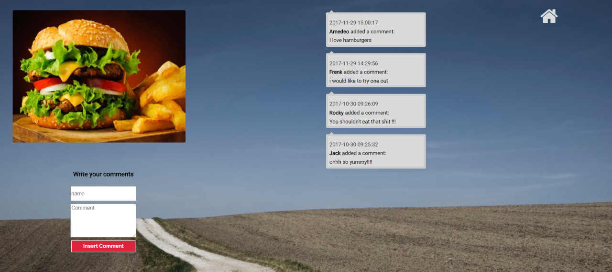
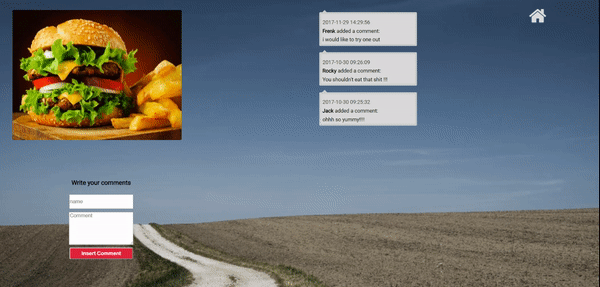

# Image Board "Your best Polaroid"

## Summary
This is a site where you can upload your picture, and it will be shown as
beautiful Polaroid. The images are intentionally displayed in a distorted manner
in order to give to users a the feeling that they are looking at images splayed out on
a kitchen table.

## Tech Stack
* Backbone.js
* PostgreSQL Database
* Express.js on Node.js
* AWS S3 Cloud Storage

## Features
* On the main page 12 picture are displayed as Polaroid images
* The user can upload his/her own images using the upload function
* Every time that an image is being loaded, it would be displayed as the first image from the left
* If the user clicks on a single image, it will be magnified for more accessible viewing
* Inside the single image page, users can see the author's name and a brief description of the image.
* Users can post comments about the image.
* Comments made on the image are displayed in a reverse chronological order.

****

****

